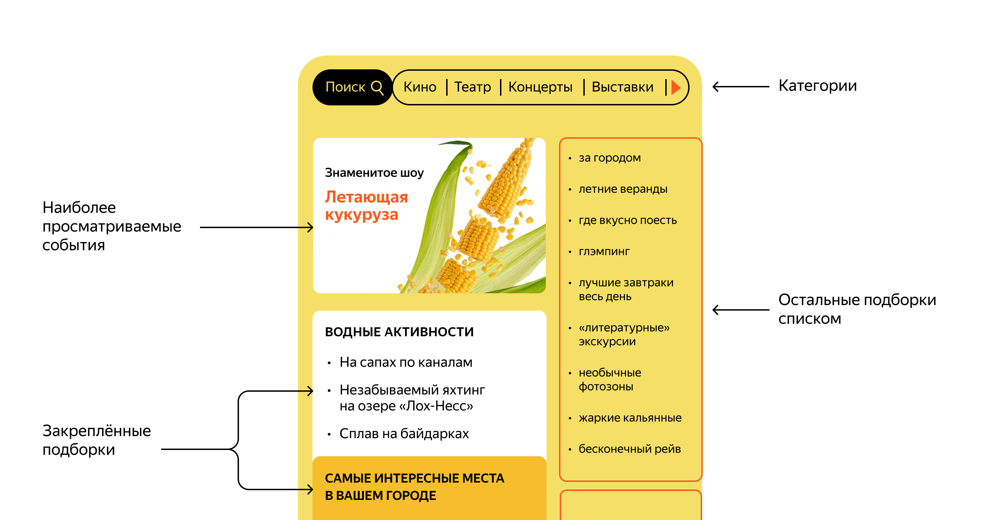
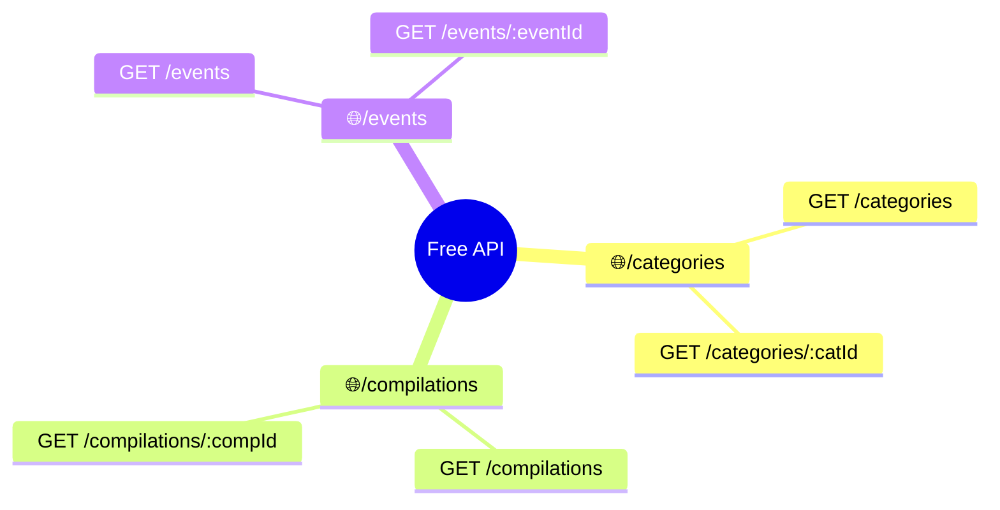
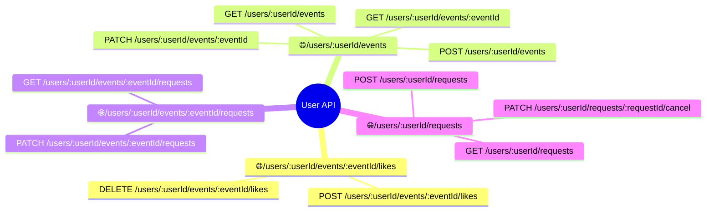
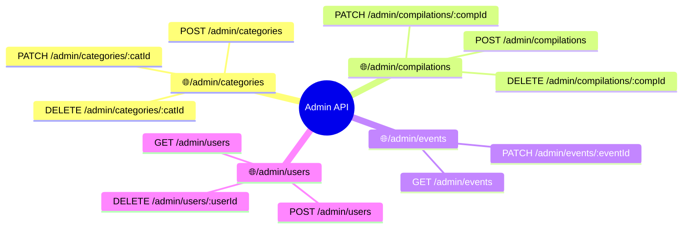
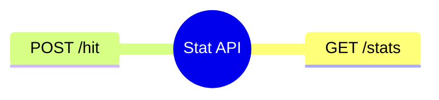

# Explore with me

## Бэкэнд для сервиса поиска мероприятий

**Учебный проект**

### Основные возможности
- Просмотр предстоящих мероприятий
- Фильтрация мероприятий по различным параметрам
- Запись на мероприятие
- Оценка мероприятия (лайк/дизлайк)
- Добавление новых мероприятий
- Одобрение/отклонение мероприятий администратором
- Групировка мероприятий по категориям 
- Создание/удаление категорий
- Учет количества просмотров по каждому мероприятию
- Топ по просмотрам для главной страницы
- Создание подборок событий
- Закрепление подборок на главной

### Состав проекта
- Основной сервис
- Сервис учета статистики

### Public API

### User API

### Admin API

### Stat API

### Database map

